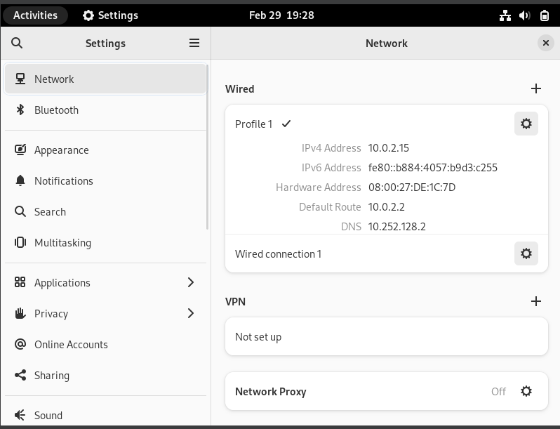

<h1 align="center">
LAPORAN PRAKTIKUM WORKSHOP

**ADMINISTRASI JARINGAN**
</h1>

“Struktur Direktori Linux”

    

<h4 align="center">
   
Disusun Oleh:

**Gede Hari Yoga Nanda  					3122500005**

**Handaru Dwiki Yuntara     				3122500017**

**Muhammad Syahrul Ramadhan				3122500030**
</h4>

<h3 align="center">  
   
2 D3 INFORMATIKA A

DEPARTEMEN TEKNIK INFORMATIKA DAN KOMPUTER JURUSAN TEKNIK INFORMATIKA
POLITEKNIK ELEKTRONIKA NEGERI SURABAYA

2023/2024
</h3> 

Struktur direktori pada Unix & Linux adalah struktur direktori yang terpadu di bawah sistem file Root “/”. Terlepas dari di mana Sistem File secara fisik dipasang, semua direktori diatur secara hierarkis di bawah sistem file Root.

**1. “/” Root**

Struktur Direktori dimulai dengan sistem file Root “/” dan memang merupakan direktori utama untuk seluruh struktur. Partisi tempat / (direktori root) akan terletak pada sistem yang kompatibel dengan UNIX. 

**2. /boot**

Direktori /boot berisi file boot loader termasuk Grub atau Lilo, Kernel, file konfigurasi initrd, dan system.map.

**3. /sys**

Ini berisi Kernel, Firmware, dan file-file terkait sistem.

**4. /sbin**

Berisi Binari Sistem penting dan alat Administrasi Sistem yang penting untuk operasi dan kinerja sistem.

**5. /bin**

Berisi binari penting untuk pengguna dan utilitas yang diperlukan dalam mode pengguna tunggal. Contohnya, termasuk cat, ls, cp, dll.

**6. /lib**

Berisi file pustaka untuk semua binari yang terdapat di direktori /sbin & /bin.

**7. /dev**

Direktori /dev berisi file-file sistem dan driver penting.

**8. /etc**

Direktori /etc berisi file konfigurasi Sistem penting termasuk file-file konfigurasi sistem dan aplikasi seperti /etc/hosts, /etc/resolv.conf, nsswitch.conf, default, dan konfigurasi jaringan lainnya.

**9. /home**

Semua direktori home pengguna disimpan di bawah direktori ini kecuali direktori home root yang disimpan di bawah direktori /root. Direktori ini menyimpan file pengguna, pengaturan pribadi seperti .profile, dll.

**10. /media**

Titik pemasangan generik untuk media yang dapat dilepas seperti CD-ROM, USB, Floppy, dll.

**11. /mnt**

Titik pemasangan generik untuk sistem file sementara. Berguna terutama saat menyelesaikan masalah dari CDROM dll di mana Anda mungkin harus memasang sistem file Root dan mengedit konfigurasi.

**12. /opt**

Sebuah direktori yang jarang digunakan di Linux untuk Paket Perangkat Lunak Opsional. Ini digunakan secara luas di sistem operasi UNIX seperti Sun Solaris di mana paket perangkat lunak diinstal.

**13. /usr**

Sub-hirarki untuk sistem file root yang merupakan direktori data pengguna. Berisi utilitas dan aplikasi spesifik pengguna. Anda akan melihat banyak sistem file penting tetapi tidak kritis dipasang di sini. Di sini Anda akan menemukan lagi direktori bin, sbin & lib yang berisi binari pengguna dan sistem non-kritis dan pustaka terkait dan direktori share. Juga ditemukan di sini adalah direktori include dengan file include.

* /usr/sbin

Berisi Binari sistem non-kritis dan utilitas jaringan non-esensial.

* /usr/bin

Berisi binari perintah non-esensial non-kritis untuk pengguna.

* /usr/lib

File pustaka untuk binari di direktori /usr/bin & /usr/sbin.

* /usr/share

Sebuah direktori data bersama yang independen platform.

* /usr/local

Sub-hirarki di bawah direktori /usr yang memiliki data Sistem Lokal termasuk binari pengguna dan sistem serta pustakanya.

**14. /var**

Direktori /var sebagian besar dipasang sebagai sistem file terpisah di bawah root di mana semua konten variabel seperti log, file spool untuk printer, crontab, pekerjaan at, email, proses yang berjalan, file kunci, dll. Harus diperhatikan dalam merencanakan sistem file ini dan perawatannya karena ini bisa cepat penuh dan ketika File System penuh dapat menyebabkan masalah operasional sistem dan aplikasi.

**15. /tmp**

Sistem file sementara yang menyimpan file sementara yang dibersihkan saat sistem di-boot. Ada juga direktori /var/tmp yang menyimpan file-file sementara juga. Satu-satunya perbedaan antara keduanya adalah bahwa direktori /var/tmp menyimpan file yang dilindungi saat sistem di-boot. Dengan kata lain, file /var/tmp tidak dihapus saat di-boot ulang.

**Berikut Mindmaps dari Strukutur Direktori Linux:**

    

<h1>Berikut Tutorial Setting Network</h1>

 setting network ip addres

    

 buka wired setting 

    

 pilih pengaturan lalu ipv4 dan pilih manual 

    

 setting addresses nya, lalu apply 

    

 cek ip address lagi apakah pastikan sudah berubah (setting berhasil)

    

selanjutnya refresh wifi dan cek apakah bisa tetap tersambung atau tidak

    

ternyata tidak connect ke internet 

 link PPT:

<link> https://www.canva.com/design/DAF-LbQcD9s/3PQI703JvkqvEKSjdG73pQ/edit</link>
