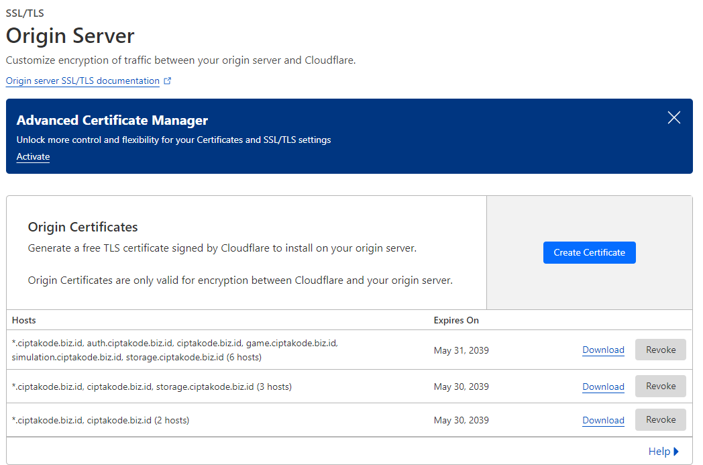

<div align="center">
  <h1 style="text-align: center;font-weight: bold">Project Charter Container Based App<br>
Mobile Apps e-TOEFL</h1>
  <h3 style="text-align: center;">Dosen Pengampu : Dr. Ferry Astika Saputra, S.T., M.Sc.</h3>
</div>
<br />
<div align="center">
  
  <h3 style="text-align: center;">Disusun Oleh : <br>Kelompok 3 dan 5</h3>
  <div style="align: center;">
    <table>
      <tr>
        <th>No</th>
        <th>Nama</th>
        <th>NRP</th>
      </tr>
      <tr>
        <td>1</td>
        <td>Gede Hari Yoga Nanda</td>
        <td>3122500005</td>
      </tr>
      <tr>
        <td>2</td>
        <td>Arsyita Devanaya Arianto</td>
        <td>3122500008</td>
      </tr>
      <tr>
        <td>3</td>
        <td>Ali Azhar</td>
        <td>3122500011</td>
      </tr>
      <tr>
        <td>4</td>
        <td>Mahendra Khibrah R. S</td>
        <td>3122500013</td>
      </tr>
      <tr>
        <td>5</td>
        <td>Mayada Azizah</td>
        <td>3122500015</td>
      </tr>
      <tr>
        <td>6</td>
        <td>Gandi Rukmaning Ayu</td>
        <td>3122500016</td>
      </tr>
      <tr>
        <td>7</td>
        <td>Adam Rasyid Nurmuhammad</td>
        <td>3122500018</td>
      </tr>
      <tr>
        <td>8</td>
        <td>Adinda Zahra Q</td>
        <td>3122500020</td>
      </tr>
      <tr>
        <td>9</td>
        <td>M Reza Muktasib</td>
        <td>3122500024</td>
      </tr>
      <tr>
        <td>10</td>
        <td>Adira Callysta</td>
        <td>3122500025</td>
      </tr>
      <tr>
        <td>11</td>
        <td>Shofira Izza N</td>
        <td>3122500026</td>
      </tr>
    </table>
  </div>

<h2 style="text-align: center;line-height: 1.5">Politeknik Elektronika Negeri Surabaya<br>Departemen Teknik Informatika Dan Komputer<br>Program Studi Teknik Informatika<br>2023/2024</h2>
</div>

## Daftar Isi

- [Daftar Isi](#daftar-isi)
- [Pendahuluan](#pendahuluan)
- [Ruang Lingkup](#ruang-lingkup)
- [Desain Sistem](#desain-sistem)
- [Tim dan Tugas](#tim-dan-tugas)
- [Tahapan Pelaksaan](#tahapan-pelaksaan)
- [Implementasi](#implementasi)
- [Sistem testing](#sistem-testing)
- [Kesimpulan](#kesimpulan)

<hr>

## Abstrak

E-TOEFL adalah aplikasi mobile berbasis Flutter yang dirancang untuk membantu mahasiswa PENS dalam mempersiapkan tes e-TOEFL. Aplikasi ini menawarkan pengalaman belajar yang dipersonalisasi, memungkinkan pengguna memilih topik latihan dan memantau skor simulasi. Backend aplikasi menggunakan Laravel untuk autentikasi dan berinteraksi dengan MongoDB NoSQL yang menyimpan data dan melakukan operasi CRUD. Docker Engine digunakan untuk mengembangkan, mengirimkan, dan menjalankan aplikasi dalam kontainer, memastikan portabilitas, isolasi, dan kemudahan deployment. Desain sistem meliputi Storage Server pada port 3000 untuk penyimpanan file, Web Server Laravel pada port 80 untuk logika bisnis dan komunikasi dengan Storage Server dan MongoDB, serta MongoDB pada port 27017 untuk penyimpanan data aplikasi. Docker Engine menghubungkan antarmuka pengguna mobile dengan layanan backend. Tahapan pelaksanaan mencakup perencanaan dan analisis, desain dan prototyping, pengembangan dan implementasi, serta deployment dan pemeliharaan. Pada sistem testing terdapat pengujian unit, integrasi, sistem, dan uji pengguna. Docker memastikan konsistensi lingkungan pengujian. Aplikasi e-TOEFL diharapkan meningkatkan aksesibilitas dan efektivitas persiapan tes e-TOEFL bagi mahasiswa dengan sistem backend yang handal dan terkontainerisasi.

*Keywords:* *e-toefl, container, docker*

## Tahap Pelaksanaan

Proyek berlangsung selama 6 minggu, mulai dari tanggal 25 April 2024 hingga 30 Mei 2024. Dimana tahapan pelaksanaannya mencakup perencanaan dan analisis hingga pengujian.

## Pendahuluan

Docker adalah platform perangkat lunak yang memudahkan pembuatan, pengujian, dan penerapan aplikasi dengan cepat. Docker mengemas perangkat lunak ke dalam kontainer yang berisi semua kebutuhan perangkat lunak agar bisa berfungsi, seperti pustaka, alat sistem, kode, dan runtime. Dengan Docker, kita dapat dengan mudah menerapkan dan menskalakan aplikasi di berbagai lingkungan. Docker memiliki beberapa manfaat yaitu, portabilitas aplikasi yang dapat dijalankan di lingkungan apapun tanpa perlu mengubah konfigurasi, isolasi yang memastikan setiap kontainer berjalan terpisah dan aman dari aplikasi lain, kemudahan deployment dan skalabilitas aplikasi untuk menambah atau mengurangi instance kontainer dengan mudah.

Pada aplikasi eTOEFL, kami menggunakan Storage Server untuk menyimpan dan mengambil data, seperti file atau dokumen besar. Kami juga memanfaatkan Web Server yang menggunakan framework Laravel untuk mengelola request pengguna serta berinteraksi dengan Storage Server dan MongoDB Database untuk operasi CRUD. Selanjutnya, MongoDB Database digunakan untuk menyimpan data aplikasi. Terakhir, Docker Engine dipakai untuk mengembangkan, mmengirimkan dan menjalankan aplikasi dalam kontainer. Kemudian, Docker akan menghubungkan antarmuka pengguna pada perangkat mobile dengan backend seperti Web Server, MongoDB, dan Storage Server.

## Ruang Lingkup

eTOEFL adalah aplikasi berbasis mobile yang dikembangkan dengan Flutter dan memungkinkan pengguna untuk mengakses berbagai fitur dengan mudah. Kemudian, backend aplikasi menggunakan framework Laravel untuk mengatur autentikasi pengguna dan berinteraksi dengan database untuk penyimpanan dan pengambilan data. Untuk database aplikasi menggunakan MongoDB NoSQL yang berfungsi menyimpan dan mengambil data dari database serta memberikan respons terhadap permintaan pengguna. Terakhir, Server berfungsi sebagai perantara antara aplikasi mobile, backend, dan database. Server juga menerima request dari pengguna, kemudian meneruskannya ke backend dan database yang nantinya akan mengirimkan kembali respons kepada pengguna

## Desain Sistem

<div align="center">
  
</div>

1. **Storage Server** berjalan pada port 3000 yang bertanggung jawab untuk menyimpan dan mengambil data, khususnya file atau dokumen besar yang diperlukan oleh aplikasi.

2. **Web Server Laravel** berjalan pada port 80, dikembangkan dengan framework laravel dengan peran sebagai pusat logika bisnis aplikasi dan mengelola permintaan dari frontend. Web server laravel bekerja untuk menerima permintaan dari docker engine, berkomunikasi dengan storage server untuk manajemen file, dan menjalankan operasi CRUD ke MongoDB database.

3. **MongoDB Database** berjalan pada port 27017 dan menerima permintaan dari web server larave melalui Docker Engine. MongoDB database bertugas untuk menyimpan data aplikasi dalam format NoSQL dan menjalankan operasi CRUD yang diminta oleh web server Laravel.

4. **Docker Engine** berperan sebagai perantara antara Mobile FE dan layanan backend seperti web server laravel, storage server, dan MongoDB database. Docker Engine berkomunikasi dengan Mobile FE melalui layanan backend yang sesuai, menerima permintaan, dan mengirimkan response.

5. **Mobile FE** berfungsi untuk menyajikan antarmuka pengguna yang dapat diakses melalui perangkat mobile. Mobile FE berinteraksi dengan Docker Engine untuk mengakses layanan backend dan menerima response.

## Tim dan Tugas

**Link Backlog:** https://docs.google.com/spreadsheets/d/1H3uiufmB5BPQeNi5vA3qUKwm-h5uV2LpxK4VTh3sPIg/edit?usp=sharing

<table class="tableizer-table">
<thead><tr class="tableizer-firstrow"><th>BACKLOG</th><th>TODO</th><th>EKSEKUTOR</th></tr></thead><tbody>
 <tr><td>Mobile Homepage</td><td>Slicing Card Target Score</td><td>Arsyita Devanaya Arianto</td></tr>
 <tr><td>&nbsp;</td><td>Consume Api Target Score</td><td>Arsyita Devanaya Arianto</td></tr>
 <tr><td>&nbsp;</td><td>Slicing Chart Pie Lingkaran</td><td>Mahendra Khibrah R. S</td></tr>
 <tr><td>&nbsp;</td><td>Consume Rank User</td><td>M Reza Muktasib</td></tr>
 <tr><td>&nbsp;</td><td>Slicing Card Navigasi Rank</td><td>Ali Azhar P.B</td></tr>
 <tr><td>&nbsp;</td><td>Consume For You List</td><td>M Reza Muktasib</td></tr>
 <tr><td>&nbsp;</td><td>Slicing For You Card</td><td>Arsyita Devanaya Arianto</td></tr>
 <tr><td>&nbsp;</td><td>Slicing Simulation Card</td><td>Arsyita Devanaya Arianto</td></tr>
 <tr><td>&nbsp;</td><td>Consume Learning Path Category Quiz</td><td>M Reza Muktasib</td></tr>
 <tr><td>&nbsp;</td><td>Slicing Learning Path Card</td><td>Arsyita Devanaya Arianto</td></tr>
 <tr><td>&nbsp;</td><td>Design Card Set Target</td><td>Gandi Rukmaning Ayu, Adinda Zahra Q, Mayada Azizah</td></tr>
 <tr><td>&nbsp;</td><td>Design Chart Pie Lingkaran</td><td>Gandi Rukmaning Ayu</td></tr>
 <tr><td>&nbsp;</td><td>Design For You Card</td><td>Mayada Azizah, Adinda Zahra Q</td></tr>
 <tr><td>&nbsp;</td><td>Design Learning Path Card</td><td>Mayada Azizah, Adinda Zahra Q</td></tr>
 <tr><td>&nbsp;</td><td>Design Simulation Card</td><td>Adinda Zahra Q, Adinda Zahra Q</td></tr>
 <tr><td>&nbsp;</td><td>Slicing Bottom Nav Bar</td><td>M Reza Muktasib</td></tr>
 <tr><td>Mobile Bookmark</td><td>Slicing Card Bookmark</td><td>Adam Rasyid Nurmuhammad</td></tr>
 <tr><td>&nbsp;</td><td>Consume Bookmark List</td><td>Mahendra Khibrah R. S</td></tr>
 <tr><td>&nbsp;</td><td>Design Card Bookmark</td><td>Mayada Azizah, Adinda Zahra Q</td></tr>
 <tr><td>Mobile Profile</td><td>Design Profile Page</td><td>Gandi Rukmaning Ayu</td></tr>
 <tr><td>&nbsp;</td><td>Consume Profile User</td><td>Shofira Izza N</td></tr>
 <tr><td>&nbsp;</td><td>Slicing Profile Page</td><td>Arsyita Devanaya Arianto</td></tr>
 <tr><td>Target Score</td><td>Slicing Target Score List</td><td>Adam Rasyid Nurmuhammad</td></tr>
 <tr><td>&nbsp;</td><td>Consume Target Score List</td><td>Mahendra Khibrah R. S</td></tr>
 <tr><td>&nbsp;</td><td>Design Target Score Page</td><td>Mayada Azizah, Adinda Zahra Q</td></tr>
 <tr><td>Simulation Test List Page</td><td>Slicing Test List Page</td><td>Mahendra Khibrah R. S</td></tr>
 <tr><td>&nbsp;</td><td>Consume List Test Page</td><td>Mahendra Khibrah R. S</td></tr>
 <tr><td>Simulation Test Page</td><td>Slicing Bottom Nav Bar</td><td>Mahendra Khibrah R. S</td></tr>
 <tr><td>&nbsp;</td><td>Design Bottom Nav Bar</td><td>Mayada Azizah, Adinda Zahra Q</td></tr>
 <tr><td>&nbsp;</td><td>Slicing List Soal Bottom Sheet</td><td>Mahendra Khibrah R. S</td></tr>
 <tr><td>&nbsp;</td><td>Design List Soal Bottom Sheet</td><td>Mayada Azizah, Adinda Zahra Q</td></tr>
 <tr><td>&nbsp;</td><td>Implementasi Logic Test Question</td><td>Mahendra Khibrah R. S</td></tr>
 <tr><td>&nbsp;</td><td>Consume Test Question Option dan Key</td><td>Mahendra Khibrah R. S</td></tr>
 <tr><td>&nbsp;</td><td>Implementasi Logic Test Session</td><td>Mahendra Khibrah R. S</td></tr>
 <tr><td>&nbsp;</td><td>Membuat State Management Test</td><td>Mahendra Khibrah R. S</td></tr>
 <tr><td>&nbsp;</td><td>Slicing Test Result</td><td>Adam Rasyid Nurmuhammad</td></tr>
 <tr><td>&nbsp;</td><td>Logic Test Result</td><td>Mahendra Khibrah R. S</td></tr>
 <tr><td>Leaderboard</td><td>Design Leaderboard</td><td>Gandi Rukmaning Ayu, Mayada Azizah</td></tr>
 <tr><td>&nbsp;</td><td>Slicing Leaderboard</td><td>Gandi Rukmaning Ayu</td></tr>
 <tr><td>&nbsp;</td><td>Consume Leaderboard</td><td>Arsyita Devanaya Arianto</td></tr>
 <tr><td>Quiz List Page</td><td>Design Quiz List Page</td><td>Gandi Rukmaning Ayu</td></tr>
 <tr><td>&nbsp;</td><td>Slicing Quiz List Page</td><td>Arsyita Devanaya Arianto, M Reza Muktasib</td></tr>
 <tr><td>&nbsp;</td><td>Consume Quiz List Page</td><td>M Reza Muktasib</td></tr>
 <tr><td>Quiz Page</td><td>Consume Quiz Question</td><td>M Reza Muktasib</td></tr>
 <tr><td>&nbsp;</td><td>Logic Take Quiz</td><td>M Reza Muktasib</td></tr>
 <tr><td>&nbsp;</td><td>Logic Result</td><td>M Reza Muktasib</td></tr>
 <tr><td>Game Page</td><td>Design Layout Game Path</td><td>Gandi Rukmaning Ayu</td></tr>
 <tr><td>&nbsp;</td><td>Slicing Layout Game Path</td><td>M Reza Muktasib</td></tr>
 <tr><td>&nbsp;</td><td>Create Logic Path Background</td><td>M Reza Muktasib</td></tr>
 <tr><td>&nbsp;</td><td>Consume List Game To Path</td><td>M Reza Muktasib</td></tr>
 <tr><td>&nbsp;</td><td>Logic Resume Session</td><td>M Reza Muktasib</td></tr>
 <tr><td>&nbsp;</td><td>Logic Quiz In Review</td><td>M Reza Muktasib</td></tr>
 <tr><td>&nbsp;</td><td>Consume Quiz Question</td><td>M Reza Muktasib</td></tr>
 <tr><td>&nbsp;</td><td>Slicing Quiz Page</td><td>Shofira Izza N</td></tr>
 <tr><td>&nbsp;</td><td>Logic Save User Answer</td><td>M Reza Muktasib</td></tr>
 <tr><td>&nbsp;</td><td>Slicing Result Quiz</td><td>Shofira Izza N</td></tr>
 <tr><td>&nbsp;</td><td>Logic Result Quiz</td><td>M Reza Muktasib</td></tr>
 <tr><td>&nbsp;</td><td>Quiz Game State </td><td>M Reza Muktasib</td></tr>
 <tr><td>&nbsp;</td><td>Slicing Bottom Sheet Game Detail</td><td>M Reza Muktasib</td></tr>
 <tr><td>&nbsp;</td><td>Slicing Bottom App Bar Game Level</td><td>M Reza Muktasib</td></tr>
 <tr><td>&nbsp;</td><td>Slicing Slash Screen</td><td>Shofira Izza N</td></tr>
 <tr><td>&nbsp;</td><td>Design Result Quiz</td><td>Gandi Rukmaning Ayu</td></tr>
 <tr><td>&nbsp;</td><td>Design Bottom Sheet Game Detail</td><td>Gandi Rukmaning Ayu</td></tr>
 <tr><td>Component</td><td>Base Button</td><td>Mahendra Kibrah R. S</td></tr>
 <tr><td>&nbsp;</td><td>Background Question</td><td>Mahendra Kibrah R. S</td></tr>
 <tr><td>&nbsp;</td><td>Setup TextTheme, Color Pallete</td><td>Mahendra Kibrah R. S, M Reza Muktasib</td></tr>
 <tr><td>&nbsp;</td><td>Answer Button Template</td><td>Mahendra Kibrah R. S, Shofira Izza N</td></tr>
 <tr><td>&nbsp;</td><td>Answer Validation Container</td><td>Mahendra Kibrah R. S</td></tr>
 <tr><td>&nbsp;</td><td>Design Component Base Button</td><td>Gandi Rukmaning Ayu, Adinda Zahra Q, Mayada Azizah</td></tr>
 <tr><td>&nbsp;</td><td>Design Answer Button</td><td>Gandi Rukmaning Ayu, Adinda Zahra Q, Mayada Azizah</td></tr>
 <tr><td>&nbsp;</td><td>Design Validation Answer</td><td>Gandi Rukmaning Ayu, Adinda Zahra Q, Mayada Azizah</td></tr>
 <tr><td>Assets</td><td>Membuat Maskot</td><td>Ali Azhar P. B</td></tr>
 <tr><td>&nbsp;</td><td>Membuat Ikon Bottom Navbar</td><td>Ali Azhar P. B</td></tr>
 <tr><td>&nbsp;</td><td>Membuat Ikon For You Card</td><td>Ali Azhar P. B</td></tr>
 <tr><td>&nbsp;</td><td>Membuat Ikon Representasi Part TOEFL</td><td>Ali Azhar P. B</td></tr>
 <tr><td>&nbsp;</td><td>Membuat Ikon Badge Game</td><td>Ali Azhar P. B</td></tr>
 <tr><td>&nbsp;</td><td>Membuat Ikon Rank</td><td>Ali Azhar P. B</td></tr>
 <tr><td>&nbsp;</td><td>Membuat Figur Orang Onboarding</td><td>Ali Azhar P. B</td></tr>
 <tr><td>&nbsp;</td><td>Membuat Figur Orang Login</td><td>Ali Azhar P. B</td></tr>
 <tr><td>&nbsp;</td><td>Membuat Assets Buku Game</td><td>Ali Azhar P. B</td></tr>
 <tr><td>&nbsp;</td><td>Membuat Ikon Reusable Black White</td><td>Ali Azhar P. B</td></tr>
 <tr><td>&nbsp;</td><td>Membuat Logo MyToefl</td><td>Ali Azhar P. B</td></tr>
 <tr><td>&nbsp;</td><td>Recreate Pilihan Target Onboarding asset</td><td>Ali Azhar P. B</td></tr>
 <tr><td>PostMan</td><td>Setup Postman</td><td>Gede Hari Yogananda</td></tr>
 <tr><td>&nbsp;</td><td>Test Docs</td><td>Gede Hari Yogananda</td></tr>
 <tr><td>&nbsp;</td><td>QuiZGameDocs</td><td>M Reza Muktasib</td></tr>
 <tr><td>Admin Panel</td><td>Setup Web Server Service</td><td>M Reza Muktasib, Gede Hari Yogananda</td></tr>
 <tr><td>&nbsp;</td><td>Setup Mazer</td><td>Gede Hari Yogananda</td></tr>
 <tr><td>&nbsp;</td><td>Membuat Form Input Test</td><td>Gede Hari Yogananda</td></tr>
 <tr><td>&nbsp;</td><td>Membuat Form Input Question Answer</td><td>Gede Hari Yogananda</td></tr>
 <tr><td>&nbsp;</td><td>Setup Login User Admin Panel</td><td>Gede Hari Yogananda</td></tr>
 <tr><td>&nbsp;</td><td>Setup Swagger</td><td>Gede Hari Yogananda</td></tr>
 <tr><td>&nbsp;</td><td>Quiz Form</td><td>M Reza Muktasib</td></tr>
 <tr><td>User Service</td><td>Setup User Service Container</td><td>M Reza Muktasib</td></tr>
 <tr><td>&nbsp;</td><td>Setup Laravel Auth</td><td>Gede Hari Yogananda</td></tr>
 <tr><td>&nbsp;</td><td>JWT AUTH</td><td>Gede Hari Yogananda</td></tr>
 <tr><td>&nbsp;</td><td>User Api</td><td>Gede Hari Yogananda</td></tr>
 <tr><td>&nbsp;</td><td>User OTP SMTP</td><td>Gede Hari Yogananda</td></tr>
 <tr><td>Test Service</td><td>Setup Test Service Container</td><td>M Reza Muktasib</td></tr>
 <tr><td>&nbsp;</td><td>Packet Test Api</td><td>Gede Hari Yogananda</td></tr>
 <tr><td>&nbsp;</td><td>Answer Test Api</td><td>Gede Hari Yogananda</td></tr>
 <tr><td>&nbsp;</td><td>Bookmark Test Api</td><td>Gede Hari Yogananda</td></tr>
 <tr><td>&nbsp;</td><td>Target Score Api</td><td>Gede Hari Yogananda</td></tr>
 <tr><td>Storage Service</td><td>Setup Container Storage</td><td>M Reza Muktasib</td></tr>
 <tr><td>&nbsp;</td><td>Setup Gateway Storage</td><td>M Reza Muktasib, Gede Hari Yogananda</td></tr>
 <tr><td>Game Service</td><td>Setup Game Service Container</td><td>M Reza Muktasib</td></tr>
 <tr><td>&nbsp;</td><td>Game Set Api</td><td>M Reza Muktasib</td></tr>
 <tr><td>&nbsp;</td><td>Game HomePage Api</td><td>M Reza Muktasib</td></tr>
 <tr><td>&nbsp;</td><td>Leaderboard Api</td><td>M Reza Muktasib</td></tr>
 <tr><td>&nbsp;</td><td>Game Answer Api</td><td>M Reza Muktasib</td></tr>
 <tr><td>&nbsp;</td><td>Scrambled Word Api</td><td>M Reza Muktasib</td></tr>
 <tr><td>&nbsp;</td><td>Pairing Game Word Api</td><td>M Reza Muktasib</td></tr>
 <tr><td>&nbsp;</td><td>Quiz Api</td><td>M Reza Muktasib</td></tr>
 <tr><td>&nbsp;</td><td>Quiz Game Claim Api</td><td>M Reza Muktasib</td></tr>
 <tr><td>Database Service</td><td>Setup MongoDB Container</td><td>M Reza Muktasib</td></tr>
 <tr><td>&nbsp;</td><td>Setup Collection</td><td>M Reza Muktasib, Gede Hari Yogananda</td></tr>
 <tr><td>Utils</td><td>Data Entry</td><td>Mayada Azizah, Adinda Zahra Q, Adira Calysta</td></tr>
 <tr><td>&nbsp;</td><td>Scraping En_Word</td><td>M Reza Muktasib</td></tr>
</tbody></table>

## Tahapan Pelaksaan

<div align="center">
  
</div>

## Implementasi

**Tahap 1: Perencanaan & Analisis (Minggu 1-2)**

**Tujuan & Sasaran:** Output dari tahap ini adalah dokumen yang berisi tujuan dan sasaran implementasi E-TOEFL. Dokumen ini harus jelas, terukur, dapat dicapai, relevan, dan berjangka waktu (SMART). <br>
**Mengidentifikasi Target Pengguna:** Output dari tahap ini adalah profil target pengguna E-TOEFL. Profil ini harus mencakup informasi demografis, kebutuhan, dan ekspektasi pengguna. <br>
**Gamifikasi:** Output dari tahap ini adalah desain gamifikasi yang akan diterapkan pada E-TOEFL. Desain ini harus menarik dan memotivasi pengguna untuk menyelesaikan tes. <br>
**Rancangan Database:** Output dari tahap ini adalah rancangan database yang akan digunakan untuk menyimpan data pengguna, hasil tes, dan informasi lainnya. <br>
**Pemilihan Teknologi:** Output dari tahap ini adalah pilihan teknologi yang akan digunakan untuk mengembangkan E-TOEFL. Pilihan teknologi ini harus mempertimbangkan faktor-faktor seperti skalabilitas, keamanan, dan kemudahan penggunaan.

**Tahap 2: Desain & Prototyping (Minggu 3-4)**

**Desain UI/UX:** Output dari tahap ini adalah desain antarmuka pengguna (UI) dan pengalaman pengguna (UX) E-TOEFL. Desain ini harus intuitif, mudah digunakan, dan estetis. <br>
**Pengembangan Konten:** Output dari tahap ini adalah konten tes E-TOEFL. Konten ini harus sesuai dengan standar internasional dan relevan dengan kebutuhan target pengguna.

**Tahap 3: Pengembangan & Implementasi (Minggu 5-6)**

**Pengembangan FE Mobile:** Output dari tahap ini adalah aplikasi mobile E-TOEFL. Aplikasi ini harus memungkinkan pengguna untuk mengikuti tes dari perangkat mobile mereka. <br>
**Pengembangan BE:** Output dari tahap ini adalah backend E-TOEFL. Backend ini harus bertanggung jawab untuk memproses data pengguna, hasil tes, dan informasi lainnya. <br>
**Containerization Docker:** Output dari tahap ini adalah container Docker untuk E-TOEFL. Container ini akan memungkinkan E-TOEFL untuk dijalankan dengan mudah di berbagai lingkungan.

**Tahap 4: Testing & Deployment (Minggu 7-8)**

**Testing Installation:** Output dari tahap ini adalah instalasi E-TOEFL di lingkungan produksi. Instalasi ini harus memastikan bahwa E-TOEFL berjalan dengan lancar dan aman. <br>
**Functional Testing:** Output dari tahap ini adalah pengujian fungsional E-TOEFL. Pengujian ini harus memastikan bahwa semua fitur E-TOEFL berfungsi dengan benar. <br>
**Uji Coba:** Output dari tahap ini adalah hasil uji coba E-TOEFL dengan pengguna nyata. Uji coba ini harus mengidentifikasi masalah dan bug yang masih ada. <br>
**Peluncuran:** Output dari tahap ini adalah peluncuran E-TOEFL ke publik. Peluncuran ini harus dilakukan dengan strategi yang tepat untuk memastikan kelancaran dan kesuksesan.

## Sistem testing

### Fungsional Testing 
**1. API**


link documentation API -> https://docs.google.com/spreadsheets/d/1-Jroqy-IDRazHRMXz3AzIXzvIScPwYVNrdnf1L9PnkQ/edit?usp=sharing

**2. Docker**
**Deskripsi Singkat**

#### A. Dockerize Service

1. Sebelumnya mari buat sebuah docker-compose.yml untuk service yang akan kita buat, pertama-tama definisikan kebutuhan dari setiap container terlebih dahulu

a. Container Admin Panel 
- Node Js untuk build frontend yang menggunakan vitejs
- Nginx untuk running port dan listener php-fpm
- Php-fpm sebagai daemon

b. Container DB
- Memerlukan Image MongoDB kasus disini kami gunakan MongoDB Community
- Setting network dan expose keluar ( disini saya pisahkan dengan webserver )

c. Container USER Service
- Nginx sebagai http server
- dan PHP-fpm sebagai daemon

d. Container Game Service
- Nginx sebagai http server
- dan PHP-fpm sebagai daemon

d. Container Simulation Service
- Nginx sebagai http server
- dan PHP-fpm sebagai daemon

e. Container Untuk Storage Service
- Minio S3 Image
- Nginx untuk port reverse httpnya


2. Setup docker-compose

dikarenakan php-fpm menggunakan port 9000 dan storage minio menggunakan port 9000 juga, maka disini saya melakukan mapping port dari range port 1290-1294 yang akan diteruskan ke local ip dari nginx server itu

Untuk mongodb saya pisahkan dan tidak menggunakan Nginx.
Bentuk dari docker-compose.yml dan Dockerfile adalah sebagai berikut:


```
root@sandbox-reza:~# cat /var/www/toefl/docker-compose.yml
version: '3.8'

services:
  web_service:
    build:
      context: ${PWD}/web_service
      dockerfile: Dockerfile
    container_name: web_service
    working_dir: /var/www/html
    ports:
      - "1291:9000"
    volumes:
      - /var/www/toefl/web_service:/var/www/html
      - /var/www/toefl/web_service/.env:/var/www/html/.env
    networks:
      - toefl_network
    depends_on:
      - node_web
    command: >
      bash -c "composer install --ignore-platform-reqs --no-interaction --no-scripts &&
               php artisan key:generate &&
               php artisan config:cache &&
               php artisan config:clear &&
               php-fpm"

  user_service:
    build:
      context: ${PWD}/user_service
      dockerfile: Dockerfile
    container_name: user_service
    working_dir: /var/www/html
    ports:
      - "1292:9000"
    volumes:
      - /var/www/toefl/user_service:/var/www/html
      - /var/www/toefl/user_service/.env:/var/www/html/.env
    networks:
      - toefl_network
    command: >
      bash -c "composer install --ignore-platform-reqs --no-interaction --no-scripts &&
               php artisan key:generate &&
               php artisan config:cache &&
               php artisan config:clear &&
               php-fpm"

  simulation_service:
    build:
      context: ./simulation_service
      dockerfile: Dockerfile
    container_name: simulation_service
    working_dir: /var/www/html
    ports:
      - "1293:9000"
    volumes:
      - /var/www/toefl/simulation_service:/var/www/html
      - /var/www/toefl/simulation_service/.env:/var/www/html/.env
    networks:
      - toefl_network
    command: >
      bash -c "composer install --ignore-platform-reqs --no-interaction --no-scripts &&
               php artisan key:generate &&
               php artisan config:cache &&
               php artisan config:clear &&
               php-fpm"

  game_service:
    build:
      context: ./game_service
      dockerfile: Dockerfile
    container_name: game_service
    working_dir: /var/www/html
    ports:
      - "1294:9000"
    volumes:
      - /var/www/toefl/game_service:/var/www/html
      - /var/www/toefl/game_service/.env:/var/www/html/.env
    networks:
      - toefl_network
    command: >
      bash -c "composer install --ignore-platform-reqs --no-interaction --no-scripts &&
               php artisan key:generate &&
               php artisan config:cache &&
               php artisan config:clear &&
               php-fpm"

  node_web:
    image: node:20-slim
    container_name: node_web
    working_dir: /var/www/html
    volumes:
      - /var/www/toefl/web_service:/var/www/html
    networks:
      - toefl_network
    command: >
      sh -c "npm cache clean --force && npm install && npm run build"

  nginx:
    image: nginx:1.24
    container_name: nginx
    ports:
      - "80:80"
      - "443:443"
    volumes:
      - .:/var/www/html
      - /var/www/toefl/nginx/default.conf:/etc/nginx/conf.d/default.conf
      - /var/www/toefl/nginx/ciptakode.crt:/etc/ssl/certs/ciptakode.crt
      - /var/www/toefl/nginx/ciptakode.key:/etc/ssl/private/ciptakode.key
    networks:
      - toefl_network
    depends_on:
      - web_service
      - user_service
      - simulation_service
      - game_service

  storage:
    image: docker.io/bitnami/minio:2022
    container_name: storage
    ports:
      - '1290:9000'
      - '9001:9001'
    networks:
      - toefl_network
    volumes:
      - 'toefl_storage:/data'
    environment:
      - MINIO_ROOT_USER=kamuiniapa
      - MINIO_ROOT_PASSWORD=akumanusia
      - MINIO_DEFAULT_BUCKETS=toefl

networks:
  toefl_network:
    driver: bridge

volumes:
  toefl_storage:
    driver: local
    
```
Laravel

```root@sandbox-reza:~# cat /var/www/toefl/Dockerfile
# Use the official PHP image
FROM php:8.2-fpm

# Set working directory
WORKDIR /var/www/html

# Install system dependencies
RUN apt-get update && apt-get install -y \
    libpng-dev \
    libjpeg62-turbo-dev \
    libfreetype6-dev \
    locales \
    zip \
    git \
    unzip \
    nano \
    libssl-dev \
    && docker-php-ext-configure gd --with-freetype --with-jpeg \
    && docker-php-ext-install gd \
    && docker-php-ext-install pdo pdo_mysql \
    && pecl install mongodb \
    && docker-php-ext-enable mongodb

# Clear cache
RUN apt-get clean && rm -rf /var/lib/apt/lists/*

# Install Composer
COPY --from=composer:latest /usr/bin/composer /usr/bin/composer

# Copy existing application directory contents
COPY . .

# Install Composer dependencies
RUN composer install

# Generate application key
RUN php artisan key:generate

# Cache configuration
RUN php artisan config:cache
RUN php artisan config:clear

# Set permissions for storage directory
RUN chown -R www-data:www-data storage bootstrap \
    && chmod -R 775 storage bootstrap \
    && find storage bootstrap -type d -exec chmod g+s {} +

# Expose port 9000 and start php-fpm server
EXPOSE 9000
CMD ["php-fpm"]
```

MongoDB

```docker run --name mongodb -p 27017:27017 -d mongodb/mongodb-community-server:latest
```

3. Supaya memudahkan development saya membuat beberapa subdomain dengan domain utama https://ciptakode.biz.id
disini saya beri SSL dari cloudflare menggunakan origin server

  <div align="center">
    
  </div>


4. kemudian setting untuk nginxnya

```
root@sandbox-reza:~# cat /var/www/toefl/nginx/default.conf
server {
    listen 80;
    server_name ciptakode.biz.id user.ciptakode.biz.id simulation.ciptakode.biz.id game.ciptakode.biz.id storage.ciptakode.biz.id;
    return 301 https://$host$request_uri;
}

# General settings for ciptakode.biz.id
server {
    listen 443 ssl;
    server_name ciptakode.biz.id;  # Replace with your domain name

    ssl_certificate /etc/ssl/certs/ciptakode.crt;
    ssl_certificate_key /etc/ssl/private/ciptakode.key;

    root /var/www/html/public;
    index index.php index.html index.htm;

    location / {
        try_files $uri $uri/ /index.php?$query_string;
    }

    location ~ \.php$ {
        include fastcgi_params;
        fastcgi_intercept_errors on;
        fastcgi_pass web_service:9000;
        fastcgi_param SCRIPT_FILENAME $document_root$fastcgi_script_name;
        #fastcgi_param SCRIPT_FILENAME /usr/share/nginx/html$fastcgi_script_name;
        fastcgi_param PATH_INFO $fastcgi_path_info;
    }

    location ~ /\.ht {
        deny all;
    }


}

# Settings for user.ciptakode.biz.id
server {
    listen 443 ssl;
    server_name user.ciptakode.biz.id;

    #ssl_certificate /etc/ssl/certs/ciptakode_user.crt;
    #ssl_certificate_key /etc/ssl/private/ciptakode_user.key;
    ssl_certificate /etc/ssl/certs/ciptakode.crt;
    ssl_certificate_key /etc/ssl/private/ciptakode.key;

    root /var/www/html/public;
    index index.php index.html index.htm;

    location / {
        try_files $uri $uri/ /index.php?$query_string;
    }

    #location ~ ^/.well-known/ {
   #     allow all;
  #      default_type application/json;
 #       try_files $uri $uri/ =404;
#    }

    location ~ \.php$ {
#                fastcgi_split_path_info ^(.+\.php)(/.+)$;

        include fastcgi_params;
        fastcgi_intercept_errors on;
        fastcgi_pass user_service:9000;
        fastcgi_param SCRIPT_FILENAME $document_root$fastcgi_script_name;
        #fastcgi_param SCRIPT_FILENAME /usr/share/nginx/html$fastcgi_script_name;
        fastcgi_param PATH_INFO $fastcgi_path_info;
    }

    location ~ /\.ht {
        deny all;
    }


#location ~ \.json$ {
    #    root /var/www/html/public;
    #    add_header Content-Type application/json;
    #}

}

# Settings for simulation.ciptakode.biz.id
server {
    listen 443 ssl;
    server_name simulation.ciptakode.biz.id;

    #ssl_certificate /etc/ssl/certs/ciptakode_simulation.crt;
    #ssl_certificate_key /etc/ssl/private/ciptakode_simulation.key;
    ssl_certificate /etc/ssl/certs/ciptakode.crt;
    ssl_certificate_key /etc/ssl/private/ciptakode.key;

    root /var/www/html/public;
    index index.php index.html index.htm;

    location / {
        try_files $uri $uri/ /index.php?$query_string;
    }

    location ~ \.php$ {
        include fastcgi_params;
        fastcgi_intercept_errors on;
        fastcgi_pass simulation_service:9000;
        fastcgi_param SCRIPT_FILENAME $document_root$fastcgi_script_name;
        fastcgi_param PATH_INFO $fastcgi_path_info;
    }

    location ~ /\.ht {
        deny all;
    }
}

# Settings for game.ciptakode.biz.id
server {
    listen 443 ssl;
    server_name game.ciptakode.biz.id;

    #ssl_certificate /etc/ssl/certs/ciptakode_game.crt;
    #ssl_certificate_key /etc/ssl/private/ciptakode_game.key;
    ssl_certificate /etc/ssl/certs/ciptakode.crt;
    ssl_certificate_key /etc/ssl/private/ciptakode.key;

    root /var/www/html/public;
    index index.php index.html index.htm;

    location / {
        try_files $uri $uri/ /index.php?$query_string;
    }

    location ~ \.php$ {
        include fastcgi_params;
        fastcgi_intercept_errors on;
        fastcgi_pass game_service:9000;
        fastcgi_param SCRIPT_FILENAME $document_root$fastcgi_script_name;
        fastcgi_param PATH_INFO $fastcgi_path_info;
    }

    location ~ /\.ht {
        deny all;
    }
}


server {
    listen 1290;
    server_name storage.ciptakode.biz.id;
    #        client_max_body_size 100M;
    # Redirect HTTP to HTTPS
    return 301 https://$host$request_uri;
}

server {
    listen 443 ssl;
    server_name storage.ciptakode.biz.id;

    #ssl_certificate /etc/ssl/certs/ciptakode_storage.crt;
    #ssl_certificate_key /etc/ssl/private/ciptakode_storage.key;
    ssl_certificate /etc/ssl/certs/ciptakode.crt;
    ssl_certificate_key /etc/ssl/private/ciptakode.key;

    # Allow special characters in headers
    ignore_invalid_headers off;
    # Allow any size file to be uploaded.
    # Set to a value such as 1000m; to restrict file size to a specific value
    client_max_body_size 10m;
    # Disable buffering
    proxy_buffering off;
    proxy_request_buffering off;

    location / {
        proxy_set_header Host $http_host;
        proxy_set_header X-Real-IP $remote_addr;
        proxy_set_header X-Forwarded-For $proxy_add_x_forwarded_for;
        proxy_set_header X-Forwarded-Proto $scheme;

        proxy_connect_timeout 300;
        # Default is HTTP/1, keepalive is only enabled in HTTP/1.1
        proxy_http_version 1.1;
        proxy_set_header Connection "";
        chunked_transfer_encoding off;

        proxy_pass http://minio_s3; # This uses the upstream directive definition to load balance
    }

    location /minio/ui/ {
        rewrite ^/minio/ui/(.*) /$1 break;
        proxy_set_header Host $http_host;
        proxy_set_header X-Real-IP $remote_addr;
        proxy_set_header X-Forwarded-For $proxy_add_x_forwarded_for;
        proxy_set_header X-Forwarded-Proto $scheme;
        proxy_set_header X-NginX-Proxy true;

        # This is necessary to pass the correct IP to be hashed
        real_ip_header X-Real-IP;

        proxy_connect_timeout 300;

        # To support websockets in MinIO versions released after January 2023
        proxy_http_version 1.1;
        proxy_set_header Upgrade $http_upgrade;
        proxy_set_header Connection "upgrade";
        # Some environments may encounter CORS errors (Kubernetes + Nginx Ingress)
        # Uncomment the following line to set the Origin request to an empty string
        # proxy_set_header Origin '';

        chunked_transfer_encoding off;

        proxy_pass http://minio_console; # This uses the upstream directive definition to load balance
    }
}

```

1. **storage**
   - URL: [https://storage.ciptakode.biz.id/](https://storage.ciptakode.biz.id/)
   - Fungsi: Menyediakan layanan penyimpanan file, termasuk materi TOEFL.

2. **user_service**
   - URL: [https://user.ciptakode.biz.id](https://user.ciptakode.biz.id)
   - Fungsi: Menangani autentikasi, OTP, dan profil pengguna.

3. **simulation_service**
   - URL: [https://simulation.ciptakode.biz.id](https://simulation.ciptakode.biz.id)
   - Fungsi: Mengelola target dan simulasi.

4. **game_service**
   - URL: [https://game.ciptakode.biz.id](https://game.ciptakode.biz.id)
   - Fungsi: Menyediakan homepage untuk game, permainan, dan kuis.

5. **web_service**
   - URL: [https://ciptakode.biz.id](https://ciptakode.biz.id)
   - Fungsi: Menyediakan panel admin.

6. **database_service**
   - Teknologi: MongoDB private
   - Fungsi: Menyimpan data secara terpusat menggunakan database MongoDB.

- Up testing
  <div align="center">
    
  </div>
- Run Testing
  <div align="center">
    
  </div>
- Restart Test
  <div align="center">
    
  </div>
- Down Testing
  <div align="center">
    
  </div>

## Kesimpulan

Melalui tahapan pelaksanaan ini, diharapkan aplikasi e-TOEFL dapat membantu mahasiswa PENS dalam mempersiapkan diri menghadapi tes e-TOEFL dengan lebih baik, memberikan pengalaman belajar yang dipersonalisasi, serta membuat tes e-TOEFL lebih mudah diakses. Implementasi teknologi yang tepat serta pengujian yang komprehensif akan memastikan aplikasi berjalan dengan baik dan memenuhi kebutuhan pengguna.

Penerapan teknologi Docker Engine dalam aplikasi E-TOEFL menghadirkan banyak keuntungan. Konsistensi dan efisiensi operasional terjamin, deployment dan skalabilitas menjadi mudah, serta keamanan dan keandalan aplikasi terjaga. Docker Engine mengisolasi aplikasi, membuatnya aman dan terlindungi. Image yang tidak dapat diubah memastikan aplikasi selalu berjalan dalam kondisi yang ideal. Keunggulan ini menjadikan Docker Engine sebagai alat penting dalam memastikan kelancaran dan keandalan E-TOEFL.

Keunggulan utama dari penggunaan Docker dalam proyek ini meliputi:

- **Portabilitas:** Aplikasi dapat berjalan di berbagai lingkungan tanpa perlu mengubah konfigurasi, sehingga memudahkan proses pengembangan dan deployment.
- **Isolasi Lingkungan:** Setiap container berjalan terpisah, yang memastikan tidak ada konflik antara layanan yang berbeda dan meningkatkan keamanan
- **Skalabilitas:** Dengan Docker, menambah atau mengurangi instance container dapat dilakukan dengan mudah sesuai kebutuhan, memungkinkan aplikasi untuk mengelola beban kerja yang dinamis
- **Efisiensi:** Docker memungkinkan pemanfaatan sumber daya yang lebih baik dan meminimalkan overhead yang biasanya terkait dengan virtualisasi tradisional.
