<h1 align="center">
LAPORAN PRAKTIKUM WORKSHOP

**ADMINISTRASI JARINGAN**
</h1>

“Setting DNS dan Ekosistem Internet”

    

<h4 align="center">
   
Disusun Oleh:

**Gede Hari Yoga Nanda  					3122500005**

**Handaru Dwiki Yuntara     				3122500017**

**Muhammad Syahrul Ramadhan				3122500030**
</h4>

<h3 align="center">  
   
2 D3 INFORMATIKA A

DEPARTEMEN TEKNIK INFORMATIKA DAN KOMPUTER JURUSAN TEKNIK INFORMATIKA
POLITEKNIK ELEKTRONIKA NEGERI SURABAYA

2023/2024
</h3> 

## Internet
Internet adalah jaringan global yang terdiri dari jaringan komputer yang saling terhubung menggunakan protokol komunikasi standar. Ini adalah infrastruktur yang memungkinkan berbagai jenis komunikasi, transfer data, dan layanan digital lainnya. Internet memungkinkan pengguna di seluruh dunia untuk mengakses informasi, berkomunikasi dengan orang lain, berbagi data, mengakses aplikasi, dan melakukan berbagai aktivitas lainnya secara online.

Internet didasarkan pada prinsip-prinsip jaringan komputer yang terdiri dari node-node (atau komputer) yang terhubung satu sama lain melalui koneksi fisik atau nirkabel. Data dikirim antara node melalui rute yang kompleks melalui berbagai jaringan penyedia layanan, termasuk kabel serat optik, kabel tembaga, satelit, dan jaringan nirkabel.
## Bagaimana Internet Bekerja?

Langkah 1: ISP dan Browser

Ketika Anda ingin mengakses internet, Anda memulai dengan perangkat seperti komputer atau smartphone yang terhubung ke Internet Service Provider (ISP). ISP Anda memberikan akses ke internet dan memungkinkan browser Anda untuk mengirim dan menerima data.

Langkah 2: DNS (Domain Name System)

Ketika Anda memasukkan alamat situs web, komputer Anda akan mencari alamat IP dari situs tersebut melalui DNS. DNS berfungsi seperti buku telepon internet yang menghubungkan nama domain dengan alamat IP.

Langkah 3: TCP (Transmission Control Protocol)

TCP mengatur bagaimana data dibagi menjadi paket yang lebih kecil untuk dikirim melalui internet. Ini juga memastikan bahwa paket-paket tersebut tiba dengan urutan yang benar dan tanpa kesalahan.

Langkah 4: HTTP (Hypertext Transfer Protocol)

HTTP adalah protokol yang digunakan oleh World Wide Web untuk mendefinisikan bagaimana pesan diformat dan ditransmisikan, serta apa tindakan yang harus dilakukan oleh server dan browser web dalam menanggapi berbagai perintah.

Langkah 5: Pertukaran Data

Setelah komputer Anda terhubung ke server, data dikirim kembali ke komputer Anda dan ditampilkan di browser sebagai halaman web. Proses ini terjadi sangat cepat berkat infrastruktur jaringan internet yang canggih.

## Infrastruktur Fisik Internet

Internet terdiri dari kabel, serat optik, satelit, dan infrastruktur nirkabel yang menghubungkan komputer di seluruh dunia. Data dan informasi dikirimkan melalui jaringan ini dalam bentuk paket-paket kecil, memungkinkan komunikasi dan akses informasi dari mana saja dan kapan saja.

## Pengembangan Standar Terbuka (Open Standards Development)

Standar terbuka memungkinkan interoperabilitas antar sistem yang berbeda dan memastikan bahwa teknologi dapat berkembang tanpa terhalang oleh batasan vendor atau platform tertentu.

## Penamaan dan Penugasan Alamat (Naming and Addressing)

Organisasi seperti IANA (Internet Assigned Numbers Authority) dan ICANN (Internet Corporation for Assigned Names and Numbers) memainkan peran penting dalam penugasan alamat IP dan pengelolaan domain tingkat atas.

## Pengembangan Kebijakan (Policy Development)

Kebijakan lokal, nasional, regional, dan global dibentuk untuk mengatur berbagai aspek internet, termasuk privasi, keamanan, dan akses.

## Pendidikan dan Pengembangan Kapasitas (Education and Capacity Building)

Inisiatif pendidikan dan pelatihan diperlukan untuk membangun keterampilan dan pengetahuan yang diperlukan untuk mendukung pertumbuhan dan inovasi dalam ekosistem internet.

## Pengguna (Users)

Pengguna internet meliputi individu, bisnis, pemerintah, dan organisasi lainnya yang semuanya terhubung dan berinteraksi dalam ekosistem ini.

## Layanan dan Operasi Bersama (Shared Global Services and Operations)

Layanan bersama seperti DNS (Domain Name System) dan infrastruktur jaringan memungkinkan pertukaran data yang efisien dan stabil di seluruh dunia.

## Pengembangan Kebijakan Multilateral (Multilateral Policy Development)

Institusi multilateral dan organisasi seperti Internet Society berkontribusi pada pembentukan kebijakan yang mempengaruhi internet secara global.

##

# Cara kerja dari iterative dan recursive dari DNS Query. misal akses detik.com

cara kerja untuk tahapan DNS :

1.  Requesting host : Komputer client mengirimkan pengiriman ke local DNS server untuk mengakses web browser detik.com.
2.  Local DNS Server: Komputer klien mengirimkan permintaan ke Root DNS server untuk mengakses situs web detik.com.
3.  Root DNS Server: Jika server DNS lokal tidak memiliki catatan dalam cache-nya, maka akan mengirimkan permintaan ke server DNS akar (Root). Server DNS akar memberikan informasi tentang server DNS yang bertanggung jawab atas domain detik.com.
4.  TLD DNS Server: Server DNS akar merujuk server DNS lokal ke server DNS TLD (Top-Level Domain) yang sesuai dengan top-level domain dari detik.com, misalnya ".com".
5.  Server DNS yang Berwenang (Authoritative DNS): Server DNS TLD kemudian merujuk server DNS lokal ke server DNS yang memiliki informasi lengkap tentang domain detik.com.
6.  Respons ke Root DNS Server: Setelah mendapatkan informasi dari server DNS yang berwenang, server DNS TLD memberikan informasi tersebut kepada server DNS lokal, yang kemudian diteruskan kembali ke server DNS akar.
7.  Respons ke Server DNS Lokal: Server DNS akar meneruskan respons dari server DNS TLD kepada server DNS lokal.
8.  Respon ke Komputer Klien: Akhirnya, server DNS lokal memberikan respons kepada komputer klien yang awalnya membuat permintaan. Komputer klien menerima informasi yang diperlukan untuk mengakses situs web detik.com. Dengan demikian, proses DNS iteratif dan rekursif telah selesai, dan komputer klien dapat mengakses situs web yang diminta.

##

# INSTALASI DNS SERVER

Saya menggunakan dokumentasi berikut sebagai refensi:
[Klik Disini](https://wiki.debian.org/Bind9#Debian_Bookworm)

Pertama-tama install bind 9 seperti berikut:

Lalu masuk ke named.conf dengan command "sudo nano named.conf" sesuaikan berdasarkan konfigurasi dokumentasi dengan beberapa penyesuaian:

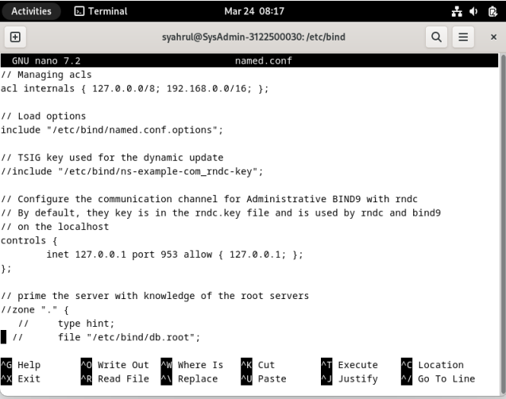

Lalu masuk ke named.conf.default-zones dengan command "sudo nano named.conf" sesuaikan berdasarkan konfigurasi dokumentasi dengan beberapa penyesuaian:

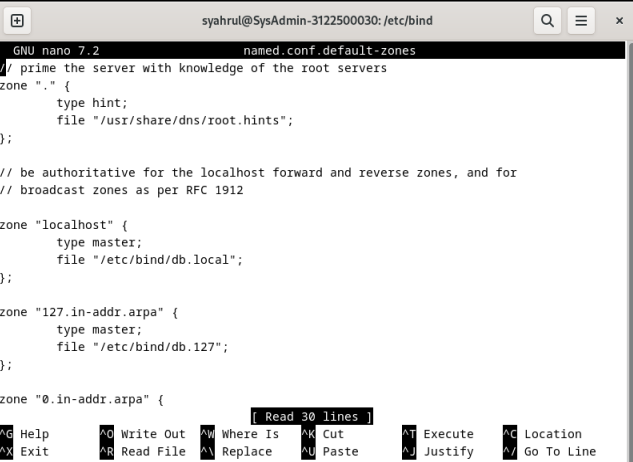

Lalu masuk ke named.conf.options dengan command "sudo nano named.conf.options" sesuaikan berdasarkan konfigurasi dokumentasi dengan beberapa penyesuaian:

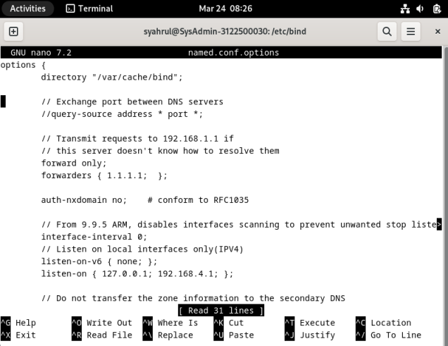

Lalu masuk ke named.conf.options dengan command "sudo nano named.conf.options" sesuaikan berdasarkan konfigurasi dokumentasi dengan beberapa penyesuaian:

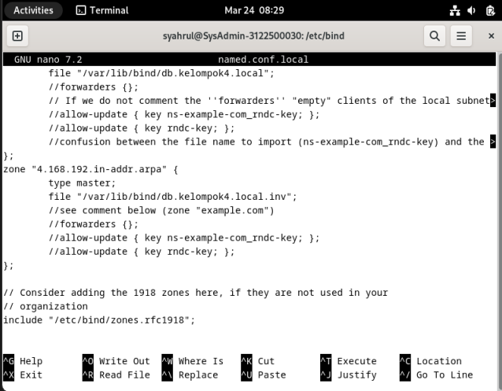

Pindah direktori ke /var/lib/bind/

Ketikan command "sudo nano db.kelompok4.local" dan sesuaikan konfigurasinya dengan dokumnetasi dengan sedikit improvisasi:

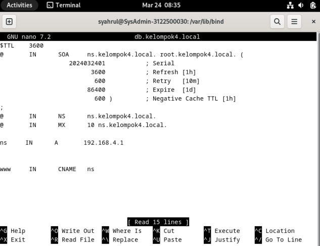

Dan juga ketikan "sudo nano db.kelompok4.local.inv" dan sesuiakan konfigurasinya dengan nama kelompok:

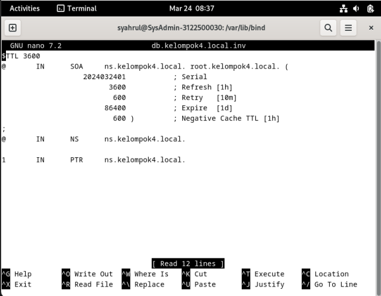

Ketikan perintah "sudo named-checkzone kelompok4.local db.kelompok4.local" jika berhasil maka akan muncul seperti dibawah ini:

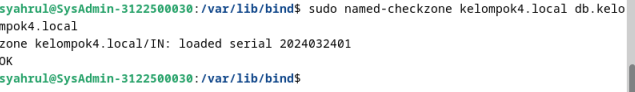

Ketikan perintah "sudo named-checkzone 4.168.192.in-addr.arpa db.kelompok4.local.inv" jika berhasil maka akan muncul status OK seperti dibawah ini:

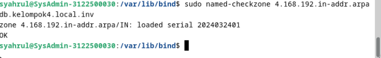

Pastikan pada wired connection anda manual dengan settingan ip dan dns seperti dibawah:

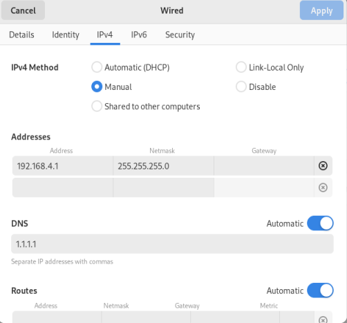

lalu cek status named dengan cara "sudo systemctl status named" pastikan running dan tidak ada masalah

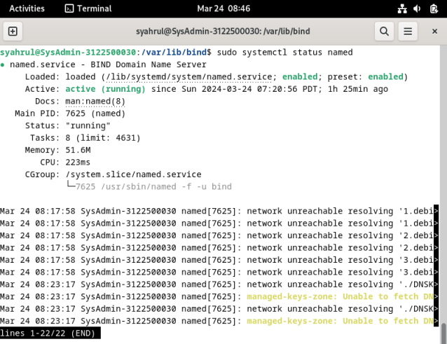

Jika error atau ada masalah dengan named cara "sudo systemctl restart named" lalu jalankan "sudo systemctl status named" pastikan running dan tidak ada masalah

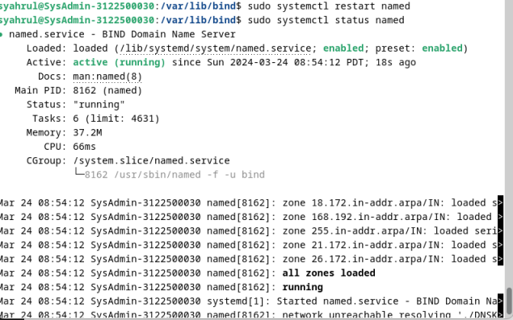

Jalankan "sudo systemctl status networking" untuk memeriksa apakah jaringan berjalan tidak ada masalah

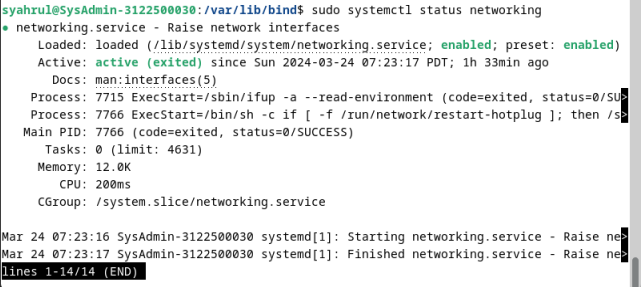

Cek "sudo nano /etc/resolv.conf" dan konfigurasi seperti dibawah:

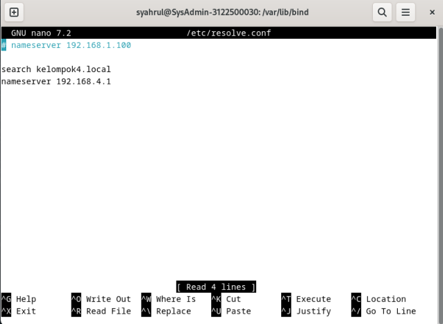

Tes menggunakan "nslookup 192.168.4.1" dan "nslookup ns.kelompok4.local" untuk melihat apakah IP sudah sesuai dengan nama kelompoknya:

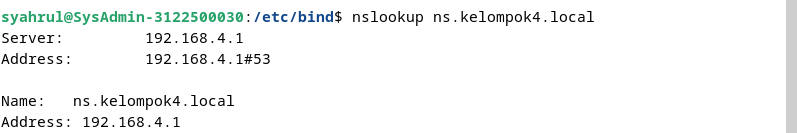
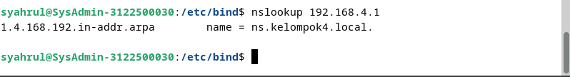

Terakhir lakukan pengetesan dengan cara "dig ns.kelompok4.local" dan "dig -x 192.168.4.1"

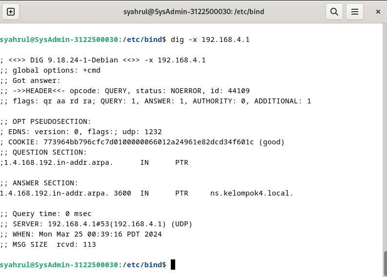
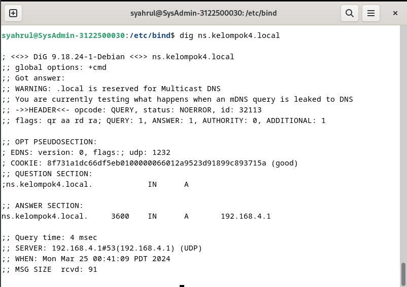
