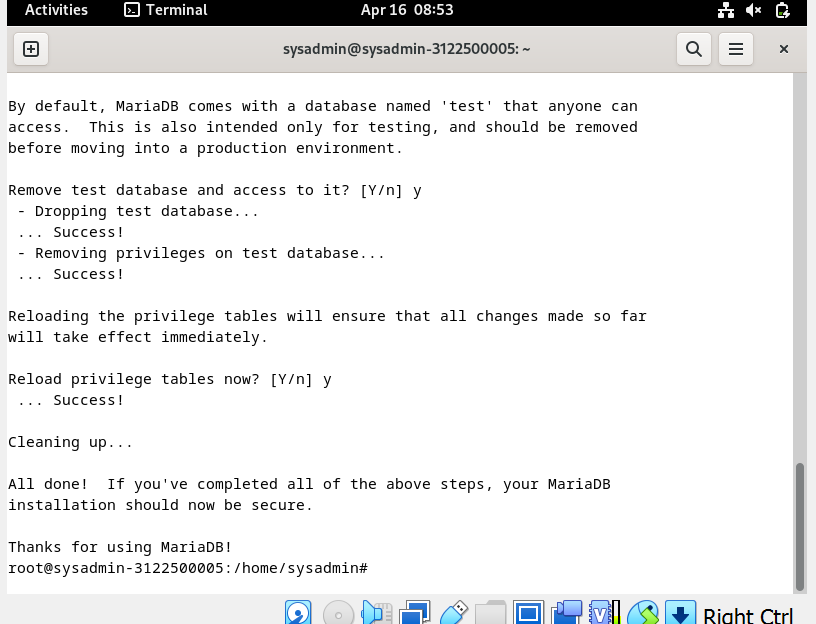
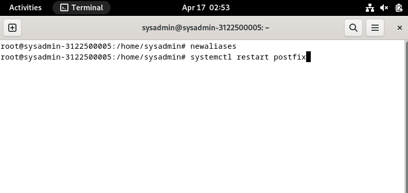

<h1 align="center">
LAPORAN PRAKTIKUM WORKSHOP

**ADMINISTRASI JARINGAN**
</h1>

“MAIL SERVER DEBIAN 10, BIND9, POSTFIX, DOVECOT, ThunderBird, RoundCube”

    

<h4 align="center">
   
Disusun Oleh:

**Gede Hari Yoga Nanda  					3122500005**

</h4>

<h3 align="center">  
   
2 D3 INFORMATIKA A

DEPARTEMEN TEKNIK INFORMATIKA DAN KOMPUTER JURUSAN TEKNIK INFORMATIKA
POLITEKNIK ELEKTRONIKA NEGERI SURABAYA

2023/2024
</h3> 

# WEB EMAIL SYSTEM

## NTP Client
1. Lakukan instalasi layanan sinkronisasi waktu

    ``apt install systemd-timesyncd``

2. Melakukan konfigurasi timezone ke Asia/Jakarta

   ``sudo timedatectl set-timezone Asia/Jakarta``  
   ``sudo timedatectl set-local-rtc false``  
   ``sudo timedatectl set-ntp true``

  

        
  

3. Edit file timesyncd.conf 

    ``sudo nano /etc/systemd/timesyncd.conf``  
    tambahkan konfigurasi : 
    NTP=0.id.pool.ntp.org  
     

        
    

4. Restart system-timesyncd

   ``sudo systemctl restart systemd-timesyncd``
   

        
    

5. Lakukan pengecekan kesesuaian tanggal system dengan perintah 

    ``sudo timedatectl``
   

        
    

## Apache 2 + PHP-FM
1. Install Apache2

   ``sudo apt -y install apache2``
    

        
    

2. Mengkonfigurasi Apache2 
    ``sudo nano /etc/apache2/conf-enabled/security.conf``  
    uncoment ServerToken Prod
    ServerTokens Prod  
    

        
    

   ``sudo nano /etc/apache2/mods-enabled/dir.conf``  
    add file agar bisa dibaca
    DirectoryIndex index.html index.htm index.php ...  
     

        
    

   ``sudo nano /etc/apache2/apache2.conf``
    - benahi spesifik ServerName ke nama domain
    ServerName www.kelompok4.local  
     

        
    

    ``sudo nano /etc/apache2/sites-enabled/000-default.conf``
    - rubah webmaster ke nama domain
    ServerAdmin webmaster@kelompok4.local  
     

        
    

    ``sudo systemctl reload apache2``
   reload untuk melakukan reload pada konfigurasi apache

4. Melakukan test apakah sudah berjalan di web browser  
    

        
    

### Install PHP 8.2

1.  Install php dengan perintah berikut
    ``apt -y install php8.2 php8.2-mbstring php-pear``
     

        
    

    berikut isntalasi berhasil : 
      

        
    

    
2. Mengkonfigurasi PHP-FM pada file konfigurasi Apache
    ``nano /etc/apache2/sites-available/default-ssl.conf``  
   tambahkan konfigurasi : 
    <FilesMatch \.php$>  
        SetHandler "proxy:unix:/var/run/php/php8.2-fpm.sock|fcgi://localhost/"  
   </FilesMatch>  
   

        
    

    `` a2enmod proxy_fcgi setenvif ``  
    

        
    

    `` a2enconf php8.2-fpm``  
     

        
    

    ``systemctl restart php8.2-fpm apache2``  
    untuk merestart kofigur yang barusan di setup

3. Melakukan test validasi dengan phpinfo()

    ``echo '<?php phpinfo(); ?>' > /var/www/html/info.php``  
     

        
    

4. Lakukan pemgecekan di broser apakah sudah tersambung
   

        
    

## Database System MariaDB

1. Lakukan instalasi Maria DB 10.11  
   ``apt -y install mariadb-server``  
    

        
    

2. Lakukan config di file berikut :  
   ``nano /etc/mysql/mariadb.conf.d/50-server.cnf``  
    character-set-server = utf8mb4  
    collation-server = utf8mb4_general_ci  
     

        
    

3. restart mariadb konfig  
    ``systemctl restart mariadb``

4. Inisial Konfigurasi dan testing database MariaDB Server

    ``mysql_secure_installation``
    

        
    

     

    jalankan:  
    ``mysql''  
    ``show grandts fot root@localhost;  `` 
    

        
    

     
    ``select user,host,password from mysql.user;``  
    ``show database``  
     

        
    

    ``create database test; `` 
    ``use test (lalu insert coba data dumy)     ``  
    ``select * from test``  
    

        
    

## Install PHPMYADMIN
1. pertama2 dengan perintah apt install phpmyadmin
   ``sudo apt -y install phpmyadmin``
   pilih apache untuk webserver
    

        
    
  

2. Tunggu proses instalasi  
    

        
    
  
3. akan ada konfigurasi untuk password  
        

        
    
  
3. lalu selesai instalasi
   

        
    
  
4. Melakukan konfigurasi pada apache2.conf  
    ``sudo nano /etc/apache2/apache2.conf``  
    

        
    
  
    
5. Lalu restart untuk merefresh dari konfigurasi  
    ``sudo systemctl restart apache2``  
    

        
    
  
6. cek apakah bisa diakses di web server phpmyadmin  
       

        
    
  
      

        
    
  
7. Menambahkan privilage ke user phpmyadmin
   ``mysql -u root -p``  
   ``GRANT ALL PRIVILEGES ON *.* TO 'phpmyadmin'@'localhost' IDENTIFIED BY 'password' WITH GRANT OPTION;
FLUSH PRIVILEGES;``  
     

        
    
  
   
    
## Install Email System POSTFIX SMTP Server 

1. install dengan perintah berikut  
    ``apt -y install postfix sasl2-bin``  
   

        
    
  
    - pilih no konfigur
     

        
    
  
   
2. copy main.cf.dist ke posfix
   ``cp /usr/share/postfix/main.cf.dist /etc/postfix/main.cf``  
     

        
    

    ``nano /etc/posfix/main.cf``
    - #line 82 : uncomment   mail_owner = postfix  
    

        
    

    
    - #line 98 : uncomment and specify hostname   myhostname = mail.kelompok4.local dan mydomain = kelompok4.local 
     

        
    

    
    - #line 127 : uncomment  
    ``myorigin = $mydomain``  
    - #line 141 : uncomment  
    ``inet_interfaces = all``
     

        
    

    
    - #line 189 : uncomment  
   `` mydestination = $myhostname, localhost.$mydomain, localhost, $mydomain ``
     

        
    

    
    - #line 277 : uncomment  
   `` mynetworks_style = subnet ``  
   `` mynetworks = 127.0.0.0/8, 10.0.0.0/24, 192.168.0.0/16``  
     

        
    
  
    ``alias_maps = hash:/etc/aliases``  
    ``alias_database = hash:/etc/aliases``
     

        
    
  
    ``home_mailbox = Maildir/ ``
     

        
    
  
    
    - #line 585: comment out and add  
    #smtpd_banner = $myhostname ESMTP $mail_name (Debian/GNU)  
    menjadi : 
    ``smtpd_banner = $myhostname ESMTP``
     

        
    

    
    - #line 659 : add  
    ``sendmail_path = /usr/sbin/postfix``  
    ``newaliases_path = /usr/bin/newaliases``  
    ``mailq_path = /usr/bin/mailq``  
    ``setgid_group = postdrop``  
      

        
    
  
    
    - #line 688 : comment out  
    #sample_directory = `` 
    ``readme_directory = `` 
    ``inet_protocols = ipv4``  
    ``disable_vrfy_command = yes ``  
    ``smtpd_helo_required = yes ``  
    ``message_size_limit = 10240000``  
    ``smtpd_sasl_type = dovecot``  
    ``smtpd_sasl_path = private/auth``  
    ``smtpd_sasl_auth_enable = yes``  
    ``smtpd_sasl_security_options = noanonymous``   
    ``smtpd_sasl_local_domain = $myhostname``  
    ``smtpd_recipient_restrictions = permit_mynetworks, permit_auth_destination,permit_sasl_authenticated, reject``  
    

        
    
  
    
3. ``newaliases ``  
    ``systemctl restart postfix ``  
     

        
    
  

    
4. Menambahkan konfigurasi anti spam
    ``nano /etc/postfix/main.cf ``
    #add to the end  
    #reject unknown clients that forward lookup and reverse lookup of their hostnames on DNS do
    not match  
    ``smtpd_client_restrictions = permit_mynetworks, reject_unknown_client_hostname, permit 
    smtpd_sender_restrictions = permit_mynetworks, reject_unknown_sender_domain, reject_non_fqdn_sender
    smtpd_helo_restrictions = permit_mynetworks, reject_unknown_hostname, reject_non_fqdn_hostname, reject_invalid_hostname, permit`` 
      

        
    
  

5. jangan lupa untuk restart  
   ``systemctl restart postfix``  

## DOVECOT : IMAP4 (TCP 143) and POP3 (TCP110) Server

1. Instalasi Dovecot Server
    ``apt -y install dovecot-core dovecot-pop3d dovecot-imapd``  
   

        
    
  
    
   ``nano /etc/dovecot/dovecot.conf``  
    benahi seperti :  
   ``listen = *, :: ``  
       

        
    
  

    
    ``nano /etc/dovecot/conf.d/10-auth.conf``  
    ``disable_plaintext_auth = no``  
    

        
    
  
    
    ``auth_mechanisms = plain login``  
     

        
    
  

    ``nano /etc/dovecot/conf.d/10-mail.conf``  
    ``mail_location = maildir:~/Maildir``  
    ``nano /etc/dovecot/conf.d/10-master.conf``  
    ``unix_listener /var/spool/postfix/private/auth {
    mode = 0666  
    user = postfix  
    group = postfix  
    } ``
     
   

        
    
  
2. Jangan lupa untuk restart dovecot dengan configurasi diatas :  
    ``systemctl restart dovecot``  

3. CHECK untuk semua SERVICES :
    ``netstat -a| grep LISTEN``  
       

        
    
  
    
### Melakukan Cek terhadap Layanan Posfix
`` telnet mail.kelompok4.local 25
`` 
   

        
    
  
 

## Test Email Menggunakan Thunderbird

1. Install Thunderbird  
    ``apt-get install thunderbird ``
     

        
    
  

    berikut tampilan dari thunderbird
      

        
    
  

3. Testing kirim email dari user pertama ke user kedua
    pesan berhasil terkirim ke user ary@mail.kelompok4.local  

5. Testing kirim email dari user kedua ke user pertama
    Berhasil saling mengirim pesan, yang mana artinya email sistem telah berjalan dengan benar.

## Email Client Menggunakan Web (ROUNDCUBE)

1. Install Roundcube terlebih dahulu  
    

        
    
  

2. Lakukan config   
    ``nano /etc/roundcube/config.inc.php``  
    

        
    
  

3. Lakukan config file apache pada roundcube, uncomment line 3 dan hapus public_html path.  
   ``nano /etc/roundcube/apache.conf``  
      

        
    
  

4. Lakukan symlink pada folder roundcube
      

        
    
  

5. Tambahkan Servername dan DocumentRoot pada file  
   ``nano /etc/apache2/sites-available/000-default.conf``  
   

        
    
  
    
6. Lakukan rekonfigurasi
    ``sudo dpkg-reconfigure roundcube-core``
   tulis mail.kelompok4.local sesuai nama domain  
    >klik ok  
      

        
    
  

    pilih language  
      

        
    
  

    pilih reinstall  

   

        
    
  

    pilih TCP IP  
     

        
    
  

    pilih localhost  
    

        
    
  

    port 3306, klik ok  
     

        
    
  

    pilih mysql_native_password  
     

        
    
  

    database name default yaitu roundcube@localhost  
      

        
    
  

    password 123  
   

        
    
  

    admin root  
      

        
    
  

    klik ya untuk restart  
   

        
    
  

    success restart  
       

        
    
  

7. Lakukan percobaan untuk mengirim pesan ke user lain.
       

        
    
  

    *berhasil terkirim ke user tujuan  
        

        
    
  

# PRAKTIKUM MENGUNAKAN WEBMAIL DALAM 1 JARINGAN

## SETUP AWAL

Pertama-tama sambungkan komputer dengan kabel ethernet lokal yang tersedia. Setelah tersambung dengan jaringan lokal pastikan IP sesuai dengan kelompok/meja gunakan command `ipconfig/all` pada kasus ini saya mendapatkan IP `192.168.4.1` karena saya merupakan kelompok 4
  

        
    
  

Lalu ubah pada setting network pada virtual machine ke Bridged Adapter dan ganti adapter sesuai dengan hasil command `ipconfig/all` yaitu `Realtek PCIe GbE Family Controller`
  

        
    
  

## SETUP DEBIAN 12

Jalankan VM anda lalu pergi ke `sudo nano /etc/bind/named.conf.options`
  

        
    
  

Rubah konfigurasi forwarders dengan `10.10.10.1` dan `192.168.4.10` ganti IP listen on ke `192.168.4.10` terakhir ganti konfigurasi `allow-query` dan `allow-recursion `ke `any`. Konfigurasinya akan menjadi seperti berikut:

  

        
    
  
  

        
    
  

Rubah juga konfigurasi di `sudo nano /etc/resolv.conf` tambahkan `nameserver 192.168.4.10` seperti dibawah berikut:

  

        
    
  

Setelah itu coba tes ping IP kelompok lain yaitu kelompok 2 dengan command `ping 192.168.2.10` jika konfigurasi network benar maka maka hasilnya akan seperti berikut:
  

        
    
  

Coba juga tes ping ke sebagai contoh `detik.com` dengan command `ping detik.com` jika konfigurasi network benar maka akan seperti dibawah ini:
  

        
    
  

Buka browser dan coba test apakah bisa mengakses webmail (roundcube) kelompok lain disini saya mencoba mengakses ke webmail kelompok 2 dengan alamat `mail.kelompok2.local` Jika berhasil maka akan tampil seperti berikut:

  

        
    
  

Buka browser dan coba test apakah bisa mengakses webmail (roundcube) dengan alamat `mail.kelompok4.local/roundcube` Jika berhasil maka akan tampil seperti berikut:
  

        
    
  

Jika network static tidak bekerja dan tidak bisa tampil seperti diatas maka coba buka `sudo nano /etc/network/interfaces` buat auto network dengan mengcomment konfigurasi static pada seperti dibawah ini:

  

        
    
  

Lalu setup manual IPv4 dengan IP addres `192.168.4.10` netmask `255.255.255.0` gateway `192.168.4.1` dan DNS `10.10.10.1`

  

        
    
  

## KONFIGURASI WINBOX

Buka winbox di windows lalu pergi ke menu bridge. Setelah itu remove bridge yang ada dan buat baru. langsung next next saja hingga bertemu setting DNS inputkan `10.10.10.1`

  

        
    
  

## HASIL AKHIR

Login ke rouncube dengan user dan password yang sudah disetup. pada kasus ini saya bisa menerima pesan dari user `iqbal@kelompok6.local` seperti pada gambar dibawah ini:

  

        
    
  
  

        
    
  

Disini saya ingin mencoba mengirim pesan email ke `user@kelompok2.local` dan berhasil
  

        
    
  
